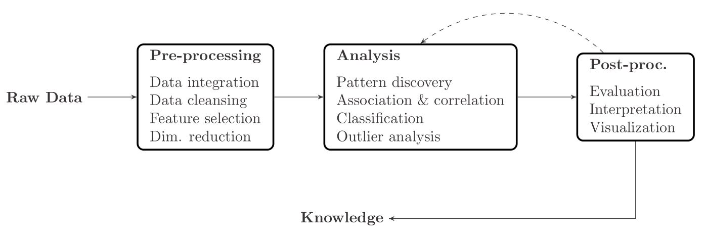
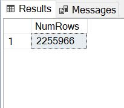
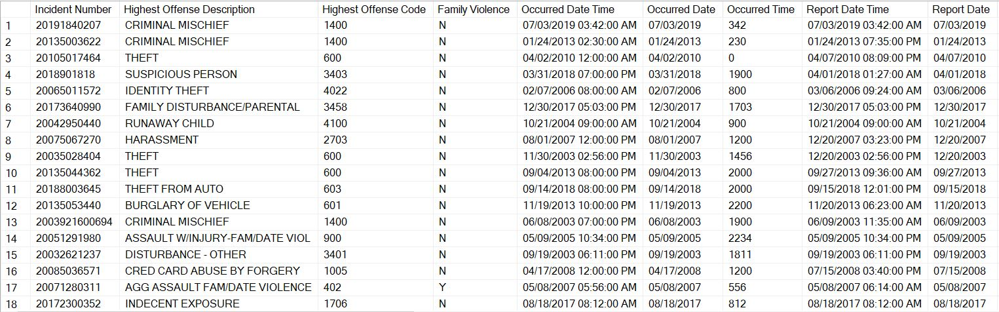

# Austin-Crime-Reports

Exploratory data analysis of Austin Police Department's crime reports.

The data was gathered from APD's [Crime Reports](https://data.austintexas.gov/Public-Safety/Crime-Reports/fdj4-gpfu) database. It ranges in crimes committed from 2003 to August 2020. 

## 1 - Introduction/Problem Definition

To have a perspective of the state of security of Austin I defined few questions, which I answered during this data analytic project. Here is the list of these questions:
1. How has the number of various crimes changed over time in Austin?
2. How have the number arrests corresponded to the crimes changed over time in Austin?
3. Which crimes are most frequently committed?
4. Which locations are these frequent crimes being committed to?
5. Are there certain high crime locations for certain crimes?
6. How has the number of certain crimes changed over the years in Austin?

To answer these question I took the four main steps of the KDD data mining pipeline, which are respectively, data preprocessing, data pre-processing, analysis and post-processing. In this documentation, I also use the same name for each section of the report. In Section 2, I describe how I gathered our data and the tasks I did in regard to clean the data as the data Pre-Processing phase. Section 3 I dive straight into the data analysis process, firstly, introducing the methods and technologies I used and then provide details on how I dealt with crime data in Spark SQL. Section 4 dives into the visualization of my results. Finally, in Section 5 I bring the conclusion.



## 2 - Data Pre-Processing: Data Extraction

### 2.1 - Data Exploration

The dataset was gathered from [data.austin.gov](https://data.austintexas.gov/). According to the information provided along with this dataset, 

> This dataset contains a record of incidents that the Austin Police Department responded to and wrote a report. Please note one incident may have several offenses associated with it, but this dataset only depicts the highest level offense of that incident. Data is from 2003 to present. This dataset is updated weekly. Understanding the following conditions will allow you to get the most out of the data provided. Due to the methodological differences in data collection, different data sources may produce different results. This database is updated weekly, and a similar or same search done on different dates can produce different results. Comparisons should not be made between numbers generated with this database to any other official police reports. Data provided represents only calls for police service where a report was written. Totals in the database may vary considerably from official totals following investigation and final categorization. Therefore, the data should not be used for comparisons with Uniform Crime Report statistics.

In general, the data included information such as data/time the crime was committed, the location where the crime occurred, type of crime, location description, whether there was an arrest, and location coordinates.

#### 2.1.1 - Size of Data

The data had 2,255,966 records and 27 columns. The list of the names of each column from left to right are as follows: Incident Number, Highest Offense Description, Highest Offense Code, Family Violence, Occurred Date Time, Occurred Date, Occurred Time, Report Date Time, Report Date, Report Time, Location Type, Address, Zip Code, Council District, APD Sector, APD District, PRA, Census Tract, Clearance Status, Clearance Date, UCR Category, Category Description, X-coordinate, Y-coordinate, Latitude, Longitude, and Location.



#### 2.1.2 - Sneak Peek into the Data

To have a quick intrusion of the structure of this dataset, here is a screenshot of the first few records. 



### 2.2 - Data Extraction

There are so many tools for data Preprocessing like Stanford Visualization Groups Data Wrangler, Redshift, or OpenRefine. These tools are fantastic and can save hours. There is overlap in their functionality as well. However, Spark SQL is incredibly easy and convenient; I used this tool to gain an insight into the data. Using Spark we find out that based on our goal in the project, the Austin Crime dataset requires one of the most important data pre-processing procedure which is *cleaning*. Our data needs to be cleansed by:

* Removing duplicate rows
* Removing missing values (NULL/NA values) in the dataset
* Fltering out all the features from the dataset that are not relevant to our data analysis (UCR Category, APD Sector, etc.)

To apply these preprocessing tasks on our dataset, I used Spark in this sequence:  First, I had a lot of corrupted data in each record that I had to remove. For instance, out of 2,255,966 records in the file, 70,627 records were filtered due to not matching with the column attribute. After that, I had to find the wrong data in each column and remove them. Then I removed the duplicate data, and finally, delete the columns I did not need so the data would be smaller and faster to work with. After making sure the data is clean. Doing such clearing, lowered the size of the data significantly.

## Analysis

As explained in a previous section, I used Spark SQL (more specifically, the `pyspark` Python library) to query to the data set to answer each of the questions I defined from the project’s goal in Section 1. 

#### Question 1: How has the number of various crimes changed over time in Austin?

From this question, we can view how each type of crime has been decreasing or increasing over the years. The following Spark SQL code will output this table as a result.
```
df_clean = df.withColumn('year',f.year(f.to_timestamp('occurred_date','MM/dd/yyyy')))

df_clean1 = df_clean.groupBy("highest_offense_description", "year").count().orderBy("year","highest_offense_description",ascending=True).show(20,False)
```

```
+------------------------------+----+-----+
|highest_offense_description   |year|count|
+------------------------------+----+-----+
|ABUSE OF OFFICIAL CAPACITY    |2003|1    |
|AGG ASLT W/MOTOR VEH FAM/DAT V|2003|9    |
|AGG ASSAULT                   |2003|327  |
|AGG ASSAULT FAM/DATE VIOLENCE |2003|258  |
|AGG ASSAULT ON PUBLIC SERVANT |2003|15   |
|AGG ASSAULT WITH MOTOR VEH    |2003|47   |
|AGG FORCED SODOMY             |2003|2    |
|AGG FORCED SODOMY OF CHILD    |2003|32   |
|AGG KIDNAPPING                |2003|2    |
|AGG PERJURY                   |2003|1    |
|AGG PROMOTION OF PROSTITUTION |2003|7    |
|AGG RAPE                      |2003|6    |
|AGG RAPE OF A CHILD           |2003|22   |
|AGG ROBBERY BY ASSAULT        |2003|19   |
|AGG ROBBERY/DEADLY WEAPON     |2003|234  |
|AGG SEXUAL ASSAULT CHILD/OBJEC|2003|37   |
|AGG SEXUAL ASSAULT W OBJECT   |2003|11   |
|AMPLIFIED MUSIC / VEHICLE     |2003|4    |
|APPLIC TO REVOKE PROBATION    |2003|25   |
|ARSON                         |2003|68   |
+------------------------------+----+-----+
only showing top 20 rows
```

#### Question 2: How have the number of arrests corresponding to the crimes changed over time in Austin?

By calculating the total amount of crimes and arrest each year, we can see how many crimes were solved and see how the crime occurred in Austin during 2003-2020. The following SQL lets us get the number of crimes and arrest each year.
